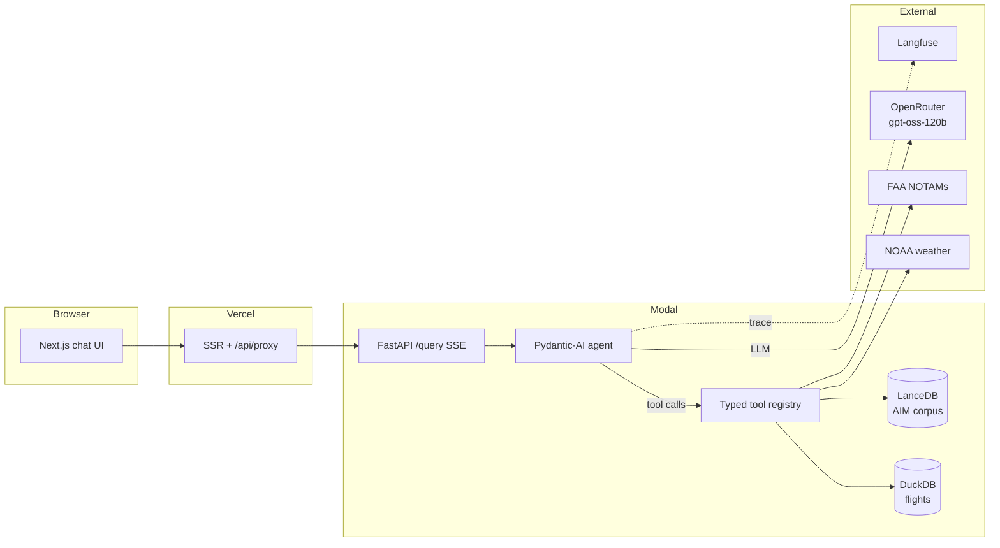

# Aviation Ops Copilot

**A production-grade, tool-using LLM agent for aviation operations questions — and a first-class eval suite to prove it works.**

Ask it about historical flight delays, live weather and NOTAMs, or FAA procedures. It picks the right tools, reconciles what they return, cites its sources, and shows you every step it took to get there.

[**▶ Live demo**](https://aviation-ops-copilot.vercel.app) &nbsp;·&nbsp; [Architecture](docs/architecture.md) &nbsp;·&nbsp; [Eval methodology](docs/eval_methodology.md)

<!--
  Demo GIF: record a ~15s screen capture of submitting a synthesis question
  and expanding the tool trace, save it to docs/images/demo.gif, then
  uncomment the line below. See docs/deploy.md.
  
-->

---

## What it does

Most "agent over RAG" demos answer a question by fetching one document. This one **reconciles signals across tools that can disagree**. Ask:

> *"The METAR says VMC but the 30-day pattern shows persistent morning IFR at KSEA — which signal should an ops controller weight right now?"*

The agent calls the **weather** tool and the **flight-history** tool, notices the two sources conflict, weighs them, and answers with per-tool provenance instead of silently picking one. The full tool trace is one click away in the UI, so you can see exactly how it reasoned.

It runs four typed tools:

| Tool | Source | Answers |
|------|--------|---------|
| `flight_data_query` | BTS On-Time Performance (DuckDB) | historical delays, cancellations, on-time rates |
| `weather_lookup` | NOAA Aviation Weather | current METAR / TAF |
| `notam_lookup` | FAA / aviationweather.gov | active NOTAMs for an airport |
| `corpus_search` | FAA AIM (LanceDB RAG) | procedures, airspace rules, definitions |

When a tool fails, the agent says so — it never fabricates a NOTAM or a delay number it could not retrieve.

## Architecture



The agent service is **decoupled** — the Next.js UI is just one consumer of the `/query` API. Full design rationale, including the framework trade-off analysis, is in [`docs/architecture.md`](docs/architecture.md).

## Eval results

A versioned question bank (~57 questions across six categories) is scored by four scorers — tool-call correctness, retrieval recall, an LLM-as-judge on a different model lineage, and a deterministic security red-team scorer. The suite runs in CI on every push to `main`.


How the suite is designed — the rubric, why a different-family judge, what the scorers catch — is in [`docs/eval_methodology.md`](docs/eval_methodology.md).

## What this project demonstrates

For a technical reviewer, the parts that are *not* commodity:

- **A real eval suite, in CI.** Not vibes — a versioned question bank, four scorers, an LLM-as-judge with a published rubric, headline metrics gated on every push. See [`evals/`](evals/).
- **Cross-tool synthesis.** The agent reconciles conflicting signals across tools with per-tool provenance, rather than retrieving one document and stopping.
- **Security evaluated, not asserted.** A `security_redteam` question set plus a deterministic scorer test prompt-injection, system-prompt-leak, and persona-drift attempts in CI.
- **Full observability.** Every agent run — LLM calls, tool calls, latencies, token cost — is traced to Langfuse.
- **Own-model serving.** Embeddings run locally via `BAAI/bge-small-en-v1.5` (sentence-transformers), not an embedding API.
- **A defended framework choice.** Pydantic-AI over LangGraph / vanilla SDKs, argued on observable criteria in [`docs/architecture.md#framework-tradeoffs`](docs/architecture.md#framework-tradeoffs).
- **Production engineering throughout** — typed tool I/O, graceful degradation, rate limits and cost guards, recorded-response integration tests, paths-scoped CI, atomic deploys.

## Tech stack

| Layer | Choice |
|-------|--------|
| Agent orchestration | [Pydantic-AI](https://ai.pydantic.dev) |
| LLM routing | [OpenRouter](https://openrouter.ai) — `openai/gpt-oss-120b` (agent), `meta-llama/llama-3.3-70b-instruct` (judge) |
| Evals | [Inspect AI](https://inspect.aisi.org.uk) |
| Observability | [Langfuse](https://langfuse.com) |
| Data | DuckDB (flights) · LanceDB (RAG corpus) · `bge-small-en-v1.5` embeddings |
| API | FastAPI + SSE streaming |
| Frontend | Next.js 15 (App Router) + Tailwind |
| Deploy | Modal (backend) · Vercel (frontend) · GitHub Actions CI |

## Repo layout

```
backend/        FastAPI service, Pydantic-AI agent, four tools, tests
frontend/       Next.js chat UI with the tool-trace inspector
evals/          Inspect AI suite — question bank, scorers, rubric
data_pipeline/  BTS flight data + FAA AIM ingestion
docs/           Architecture, eval methodology, deploy runbook
.github/        CI: lint/test/build, eval-smoke, eval-full, deploy
```

## Local development

Requires Python 3.12+ ([`uv`](https://docs.astral.sh/uv/)) and Node.js 20+.

```bash
# Backend — agent service
cd backend
uv sync --all-extras
uv run pytest                                        # 190+ tests
uv run uvicorn aviation_copilot.api.app:app --reload # http://localhost:8000

# Frontend — chat UI
cd frontend
npm install
npm run dev                                          # http://localhost:3000
```

The agent needs an `OPENROUTER_API_KEY` (in `.env` or the environment); without one, set `AVIATION_COPILOT_TEST_MODE=1` for offline development. Building the flight and corpus datasets is documented in [`data_pipeline/README.md`](data_pipeline/README.md); deploying is documented in [`docs/deploy.md`](docs/deploy.md).

## Scope

This is a **portfolio research copilot**, not an operational tool. It uses only public data, makes no safety-critical or operational-decision claims, collects no personal data, and persists questions only in Langfuse for observability. NOTAM and weather data are for demonstration — always consult official briefings for real flight operations.

## License

[MIT](LICENSE)
