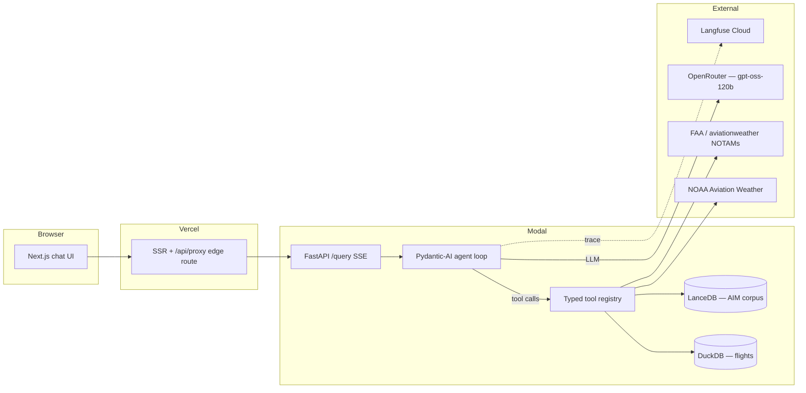

# Architecture

How Aviation Ops Copilot is built and why. This is the deeper companion to the
[README](../README.md) — the design rationale a technical reviewer would want.

## Overview

Three deployable pieces: a **Next.js frontend** on Vercel, a **FastAPI agent
service** on Modal, and a **Modal Volume** holding the data. The frontend never
talks to Modal directly — the browser hits a same-origin `/api/proxy` route
that forwards to Modal, so the backend URL stays server-side and the backend
can be swapped without a frontend change.

## The agent loop

The agent is a single async loop built on Pydantic-AI. One invocation:

1. `POST /query` opens a structured `Trace` and an SSE stream.
2. `run_with_trace` calls `agent.run(question)`. Pydantic-AI drives the
   LLM ⇄ tool loop: the model requests a tool, the tool runs, its typed result
   is fed back, repeat until the model produces a final answer.
3. Each tool appends `tool_call` / `tool_result` / `error` entries to the
   `Trace`; `run_with_trace` appends the LLM-call summary.
4. The completed `Trace` is replayed into Langfuse (off the hot path) and
   persisted in-memory for `GET /trace/{id}`.

The `Trace` is the contract between the agent and three consumers: the UI's
tool-trace inspector, the eval scorers, and Langfuse. One structure, three
readers — eval behaviour and production behaviour are identical by construction,
because the eval suite calls the same `run_with_trace`.

### Error propagation

- `ToolError(retryable=True)` → the agent retries once; if it still fails the
  model is told the tool is unavailable and adapts its answer.
- `ToolError(retryable=False)` → surfaced immediately, no retry.
- Either way the run ends with a **graceful answer that acknowledges the gap** —
  never a fabricated NOTAM or delay figure — and the failure is recorded in the
  trace. Any uncaught exception becomes a sanitized HTTP 502.

## Tool I/O contract

Every tool is a typed unit: a Pydantic `Input` model bounds what the LLM may
request, a Pydantic `Output` model bounds what it gets back. Inputs and outputs
are validated before and after the tool body runs. Tools raise
`ToolError(reason, retryable)`; the loop reacts on `retryable`. Network tools
use `httpx.AsyncClient` with explicit 5s timeouts and map upstream failures to
sanitized `ToolError`s — no raw URLs or stack traces reach the model.

This keeps tools **unit-testable without an LLM**: a tool is just an async
function over typed models.

## Framework tradeoffs

The agent orchestration layer is **Pydantic-AI**, chosen over LangGraph and a
hand-written loop on a vanilla provider SDK. The comparison, on observable
criteria rather than taste:

| Criterion | Vanilla SDK loop | LangGraph | **Pydantic-AI** |
|-----------|------------------|-----------|-----------------|
| LOC for this agent loop | ~200 (bespoke retry, tool dispatch, trace) | ~100 + graph/config boilerplate | **~50, readable in one screen** |
| Typed tool I/O | hand-rolled | partial | **Pydantic models, both directions** |
| Streaming support | manual | yes | **yes, native** |
| Multi-provider | per-SDK rewrite | adapter layer | **OpenAI-compatible — works directly with OpenRouter** |
| Observability hooks | build it yourself | callbacks | **structured run result, easy to wrap** |
| Abstraction surface to debug | small but all yours | large (state graph) | **small, library source is readable** |
| JD keyword recognition | n/a | high | moderate |

**Vanilla SDK** was rejected: ~200 lines of bespoke orchestration is
maintenance cost without quality gain. **LangGraph** was rejected: its
state-graph model is heavier than a four-tool single-loop agent needs, and the
extra abstraction is more surface for bugs. Its one real advantage —
recognition in job descriptions — is addressed by *this section* rather than by
adopting a framework that fights the problem size.

The honest trade-off accepted: less name recognition with non-technical
readers. Mitigation: this document.

## Model selection

Two models, deliberately from **different lineages**:

- **Agent — `openai/gpt-oss-120b`** (OpenRouter, ~$0.04/$0.18 per 1M tokens).
  Selected for reliable native function-calling and no rate limits (a
  rate-limited free tier would break CI eval runs). Expected spend is under
  $2/month at portfolio scale.
- **Judge — `meta-llama/llama-3.3-70b-instruct`** (paid tier). A Meta-trained
  model judging an OpenAI-trained agent reduces same-family scoring bias — a
  judge does not get to grade its own lineage kindly. The paid tier avoids the
  free-tier daily cap that would rate-limit out mid-suite.

The agent model is a one-line config change (`agent_model` in `config.py`),
routed through OpenRouter, so swapping to a frontier model (`claude-sonnet`,
`gemini-2.5-pro`) for an ablation costs nothing structural. To re-run the
selection comparison, point a 10-question multi-tool eval subset at each
candidate and compare `tool_call_accuracy` — the eval suite is the instrument.

## Why local embeddings

Retrieval embeddings run **in-process** via `sentence-transformers`
`BAAI/bge-small-en-v1.5` (33M params, 384-dim, CPU-fast, strong on MTEB). It
needs no external API, fits in the container, and the weights cache to the
Modal Volume so they load once. Calling an embedding API would be marginally
simpler operationally but a weaker signal — serving your own model is the
point. `text-embedding-3-small` is the documented fallback if volume-load
timing ever proves unworkable.

## Why DuckDB and LanceDB

Both are **single-file, embedded, zero-infrastructure** stores that ship on the
Modal Volume — no database server to host, secure, or pay for.

- **DuckDB** for flights: a columnar analytical engine, fast at the aggregate
  queries the flight tool needs over ~10M rows (2 years × top-50 US airports),
  read-only at runtime so there is no write contention.
- **LanceDB** for the corpus: a Python-native vector store, ample for the
  ~5–20K embedded AIM chunks, also a single directory on disk.

The data is mounted read-only at runtime: no write hazards, and a data refresh
is independent of a code deploy.

## Deployment topology

The Modal image is **thin** — runtime Python deps only, read from
`pyproject.toml` so it never drifts. Data and model weights live on the Modal
Volume, not in the image, so cold starts stay fast (~1–3s image; the first
request after a cold start also pays a one-time volume-mount + model-load cost).
A scheduled GitHub Actions healthcheck pings `/healthz` during demo hours,
keeping one container warm so most visitor first-requests are effectively warm.
Modal's atomic deploys mean a broken health check leaves the previous revision
live. Full procedure: [`deploy.md`](deploy.md).

## Observability

Every agent run is exported to Langfuse: one trace, with a child span per LLM
call and per tool call, carrying latency, token counts, and cost. Export
happens **after** the run completes by replaying the structured `Trace`, so a
Langfuse outage can never affect an answer. When Langfuse credentials are
absent the observer is a no-op and the agent runs untouched — local dev and CI
need no keys.

## Testing strategy

- **Unit tests** with Pydantic-AI's `TestModel` / `FunctionModel` — deterministic,
  offline, no API key.
- **Integration tests** drive the full FastAPI → agent → tools → trace → SSE
  path with scripted `FunctionModel` cassettes and `respx`-mocked HTTP —
  deterministic, free, fast.
- **Evals** exercise real LLM behaviour against the real model on every push to
  `main` — see [`eval_methodology.md`](eval_methodology.md).

Unit tests prove logic in isolation; integration tests prove the layers wire
together; evals prove the agent is actually good. All three are needed.
